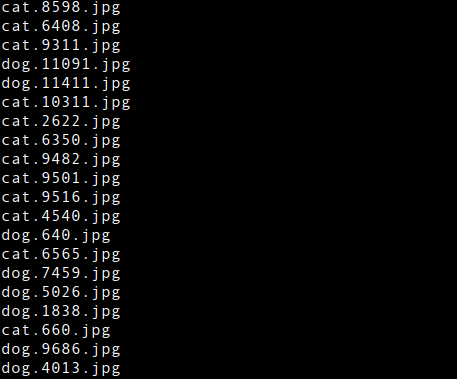
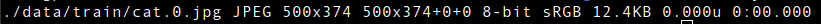

# DogsvsCats-Classification

## Download and Prepare Dataset

    For this video, we are going to use the Dog vs Cat Image classification dataset available on Kaggle. You can directly download the zip file using the link from the description or setup the Kaggle API on your system and use the following command to download the zip file. 

    ```jsx
    mkdir ~/DogsvsCats
    cd ~/DogsvsCats
    mkdir data
    cd data
    kaggle competitions download -c dogs-vs-cats
    unzip dogs-vs-cats.zip
    unzip train.zip
    unzip test1.zip
    rm dogs-vs-cats.zip train.zip test1.zip
    cd ..
    tree -d
    ls data/train/ -U | head -20
    identify ./data/train/cat.0.jpg
    ```

    Our project structure looks something like this 

    

    And the images are placed under the `train` directory and they look something like this

    

    We can look into the brief details about any image sample.

    

